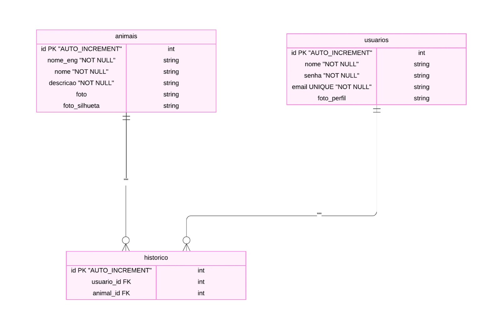
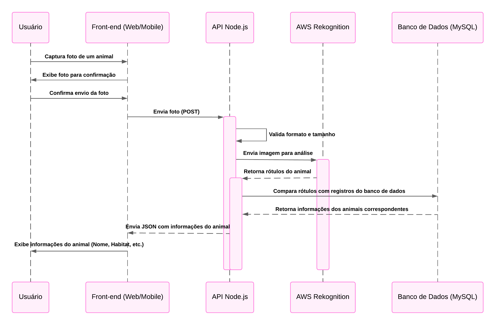
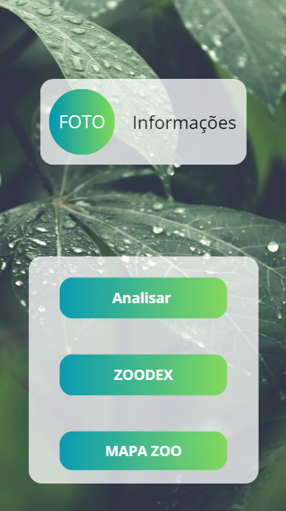

# Zoodex — Guia Interativo de Animais para Zoológicos

# **Resumo do Projeto**

Este projeto visa desenvolver uma aplicação web móvel interativa para zoológicos, que utiliza tecnologias de reconhecimento de imagem para oferecer aos visitantes uma maneira envolvente e informativa de aprender sobre os animais. A ideia é que o visitante possa tirar uma foto do animal em exposição com o celular, enviá-la para o sistema e, com base na imagem, receber informações detalhadas sobre a espécie, incluindo curiosidades, habitat e comportamento (para quem conhece Pokémon, o funcionamento seria semelhante ao de uma pokédex). Além disso, o sistema também oferece um mapa do zoológico, indicando a localização de cada animal e facilitando a navegação pelo espaço.

A solução é pensada para enriquecer a experiência do visitante, promovendo educação ambiental de maneira interativa.

# Definição do Problema

Atualmente, a maioria dos zoológicos oferece informações sobre os animais através de placas fixas, que podem ser limitadas em conteúdo e não atraem adequadamente a atenção dos visitantes, especialmente dos mais jovens. A falta de interatividade e o formato estático das informações dificultam o engajamento do público com a fauna e a absorção de conhecimento sobre as espécies e sua preservação.

Diante disso, o desafio é criar uma solução que torne o acesso às informações sobre os animais mais interativo, dinâmico e acessível. Essa solução precisa não apenas fornecer conteúdo relevante, mas também criar uma experiência envolvente para os visitantes, incentivando-os a aprender de maneira divertida e moderna, utilizando tecnologias familiares como smartphones e reconhecimento de imagem. Isso trará mais atratividade e aumentará o interesse na visitação, ao mesmo tempo em que promove a conscientização ambiental.

# Objetivos

Criar uma aplicação acessível via web e dispositivos móveis, capaz de identificar automaticamente animais em zoológicos por meio de fotos tiradas pelos visitantes e fornecer informações relevantes sobre cada espécie, integrando um mapa para auxiliar na navegação e na experiência no local.

### Objetivos Específicos

- Desenvolver um sistema de reconhecimento de imagens capaz de identificar diferentes espécies de animais.
- Fornecer informações detalhadas sobre os animais, incluindo nome científico, habitat, dieta, status de conservação e curiosidades.
- Criar um mapa interativo do zoológico que ajude os visitantes a encontrar os animais.

# Stack Tecnológico

- **Github:** Será utilizado para armazenar o código-fonte do front-end e back-end, permitindo o controle de versão e a colaboração eficiente entre os desenvolvedores. Também será usado o Github Actions, que possibilita automatizar o deploy de alterações da aplicação diretamente na nuvem.
- **AWS Rekognition:** Será utilizado para identificar os animais nas fotos enviadas pelos usuários.
- **AWS EC2:** Será usado para hospedar tanto o back-end quanto o front-end da aplicação. O FastAPI, que processa as solicitações de reconhecimento de imagem e armazena informações no banco de dados, rodará em instâncias EC2.
- **AWS CloudFront:** Será usado para fornecer o site com suporte a HTTPS, garantindo a comunicação segura entre os usuários e a aplicação. O certificado SSL será configurado no CloudFront para criptografar a conexão entre o navegador do usuário e o servidor, aumentando a segurança dos dados.
- **AWS Route 53:** Será utilizado no projeto para gerenciar o domínio da aplicação e conectar o nome de domínio personalizado ao CloudFront, EC2 ou outros serviços da AWS.
- **HTML/CSS/JavaScript**: Linguagens utilizadas para programar o front-end da aplicação.
- **Node.js:** Será utilizado para criar toda a API do projeto, centralizando a lógica do sistema. A API receberá as imagens enviadas pelos usuários, processará essas imagens com o AWS Rekognition e retornará os resultados. Além disso, o Node.js será responsável por gerenciar a lógica de negócios, como o armazenamento e a recuperação de informações sobre os animais, e a comunicação com o banco de dados.
    
    Também será utilizado para gerenciar a autenticação e login dos usuários, implementando um sistema baseado em **JWT (JSON Web Token)**, que permitirá aos visitantes criar contas, fazer login e gerenciar suas sessões com segurança.
    

# Descrição da Solução

A aplicação “Pokédex de Animais Reais” será desenvolvida como uma solução completa para visitantes de zoológicos. Ela permitirá que os usuários tirem fotos dos animais que estão observando, e um sistema de reconhecimento de imagem integrado identificará o animal. Após a identificação, a aplicação exibirá informações detalhadas sobre o animal no celular do visitante, incluindo dados científicos, curiosidades e vídeos. Um mapa interativo será integrado à aplicação, mostrando a localização exata do animal dentro do zoológico, auxiliando o visitante a navegar pelos diferentes espaços. Além disso, a interface será otimizada para proporcionar uma experiência fluida, tanto em dispositivos móveis quanto na versão web.

# Arquitetura

### Diagrama EMR do Banco de Dados:

### Diagrama de Fluxo de Dados

### Mockup

