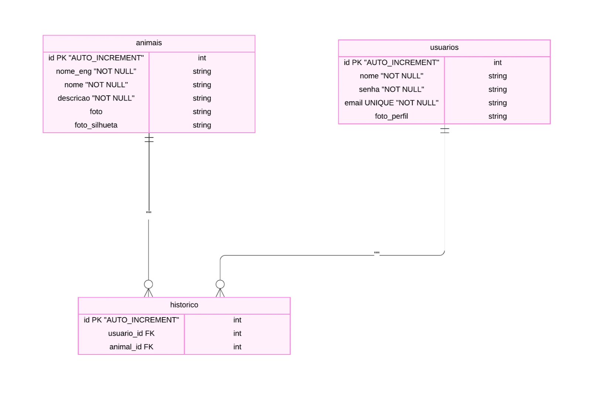
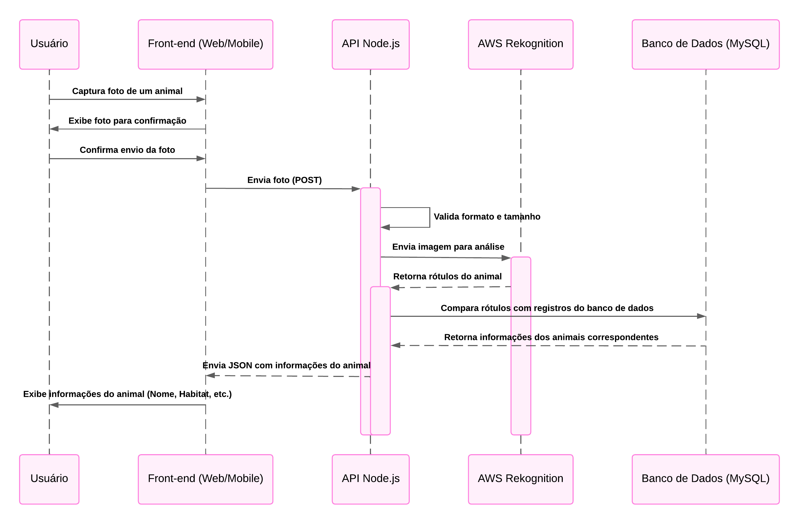
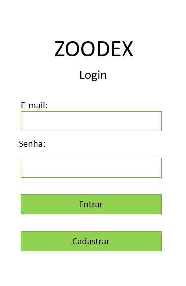
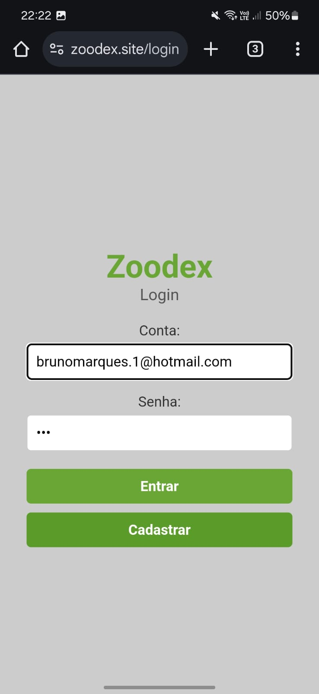
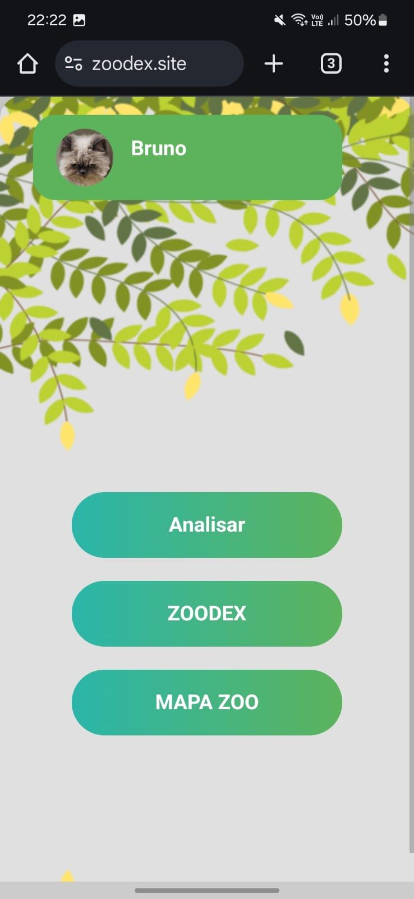
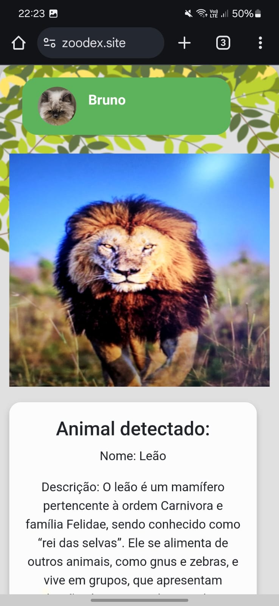
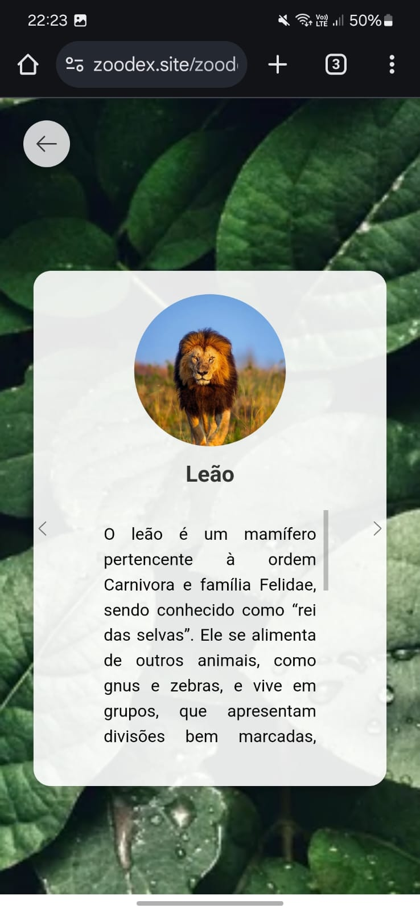

# Zoodex — Guia Interativo de Animais para Zoológicos

# **Resumo do Projeto**

Este projeto visa desenvolver uma aplicação web móvel interativa para zoológicos, que utiliza tecnologias de reconhecimento de imagem para oferecer aos visitantes uma maneira envolvente e informativa de aprender sobre os animais. A ideia é que o visitante possa tirar uma foto do animal em exposição com o celular, enviá-la para o sistema e, com base na imagem, receber informações detalhadas sobre a espécie, incluindo curiosidades, habitat e comportamento (para quem conhece Pokémon, o funcionamento seria semelhante ao de uma pokédex). Além disso, o sistema também oferece um mapa do zoológico, indicando a localização de cada animal e facilitando a navegação pelo espaço.

A solução é pensada para enriquecer a experiência do visitante, promovendo educação ambiental de maneira interativa.

# Definição do Problema

Atualmente, a maioria dos zoológicos oferece informações sobre os animais através de placas fixas, que podem ser limitadas em conteúdo e não atraem adequadamente a atenção dos visitantes, especialmente dos mais jovens. A falta de interatividade e o formato estático das informações dificultam o engajamento do público com a fauna e a absorção de conhecimento sobre as espécies e sua preservação.

Diante disso, o desafio é criar uma solução que torne o acesso às informações sobre os animais mais interativo, dinâmico e acessível. Essa solução precisa não apenas fornecer conteúdo relevante, mas também criar uma experiência envolvente para os visitantes, incentivando-os a aprender de maneira divertida e moderna, utilizando tecnologias familiares como smartphones e reconhecimento de imagem. Isso trará mais atratividade e aumentará o interesse na visitação, ao mesmo tempo em que promove a conscientização ambiental.

# Objetivos

Criar uma aplicação acessível via web e dispositivos móveis, capaz de identificar automaticamente animais em zoológicos por meio de fotos tiradas pelos visitantes e fornecer informações relevantes sobre cada espécie, integrando um mapa para auxiliar na navegação e na experiência no local.

### Objetivos Específicos

- Desenvolver um sistema de reconhecimento de imagens capaz de identificar diferentes espécies de animais.
- Fornecer informações detalhadas sobre os animais, incluindo nome científico, habitat, dieta, status de conservação e curiosidades.
- Criar um mapa interativo do zoológico que ajude os visitantes a encontrar os animais.

# Stack Tecnológico

- **Github:** Será utilizado para armazenar o código-fonte do front-end e back-end, permitindo o controle de versão e a colaboração eficiente entre os desenvolvedores. Também será usado o Github Actions, que possibilita automatizar o deploy de alterações da aplicação diretamente na nuvem.
- **AWS Rekognition:** Será utilizado para identificar os animais nas fotos enviadas pelos usuários.
- **AWS EC2:** Será usado para hospedar tanto o back-end quanto o front-end da aplicação. O FastAPI, que processa as solicitações de reconhecimento de imagem e armazena informações no banco de dados, rodará em instâncias EC2.
- **AWS CloudFront:** Será usado para fornecer o site com suporte a HTTPS, garantindo a comunicação segura entre os usuários e a aplicação. O certificado SSL será configurado no CloudFront para criptografar a conexão entre o navegador do usuário e o servidor, aumentando a segurança dos dados.
- **AWS Route 53:** Será utilizado no projeto para gerenciar o domínio da aplicação e conectar o nome de domínio personalizado ao CloudFront, EC2 ou outros serviços da AWS.
- **HTML/CSS/JavaScript**: Linguagens utilizadas para programar o front-end da aplicação.
- **Node.js:** Será utilizado para criar toda a API do projeto, centralizando a lógica do sistema. A API receberá as imagens enviadas pelos usuários, processará essas imagens com o AWS Rekognition e retornará os resultados. Além disso, o Node.js será responsável por gerenciar a lógica de negócios, como o armazenamento e a recuperação de informações sobre os animais, e a comunicação com o banco de dados.
    
    Também será utilizado para gerenciar a autenticação e login dos usuários, implementando um sistema baseado em **JWT (JSON Web Token)**, que permitirá aos visitantes criar contas, fazer login e gerenciar suas sessões com segurança.
    

# Descrição da Solução

A aplicação “Pokédex de Animais Reais” será desenvolvida como uma solução completa para visitantes de zoológicos. Ela permitirá que os usuários tirem fotos dos animais que estão observando, e um sistema de reconhecimento de imagem integrado identificará o animal. Após a identificação, a aplicação exibirá informações detalhadas sobre o animal no celular do visitante, incluindo dados científicos, curiosidades e vídeos. Um mapa interativo será integrado à aplicação, mostrando a localização exata do animal dentro do zoológico, auxiliando o visitante a navegar pelos diferentes espaços. Além disso, a interface será otimizada para proporcionar uma experiência fluida, tanto em dispositivos móveis quanto na versão web.

# Arquitetura/Artefatos

## Diagrama EMR do Banco de Dados:

  

## Diagrama de Fluxo de Dados

  

## Wireframe

  

  

  

  

  

  

## Mockup

  

  

  

  

## Casos de Uso

### **Caso de Uso: Identificação de um Animal a partir de uma Foto**

**Descrição**: Este caso de uso descreve como um visitante interage com o sistema para identificar um animal no zoológico e receber informações detalhadas sobre ele.

### **Atores**:

1. **Visitante**: Pessoa utilizando o aplicativo no zoológico.
2. **Sistema Zoodex**: Aplicação que processa a foto e retorna informações.

### **Fluxo Principal**:

1. O visitante acessa a aplicação Zoodex por meio do navegador no celular.
2. Realiza o login ou cadastro na aplicação para iniciar a experiência personalizada.

    

3. Na tela inicial, o visitante visualiza três opções principais:
    - **Analisar Animal**: Permite identificar um animal através de uma foto.
    - **Zoodex**: Mostra os animais já identificados e informações detalhadas sobre eles.
    - **Mapa do Zoológico**: Exibe uma imagem estática do mapa para orientar o visitante.

    

4. O visitante seleciona a opção **Analisar Animal**.
5. O sistema solicita permissão para acessar a câmera do celular.
6. O visitante tira uma foto do animal que está observando.
7. A aplicação exibe a foto para confirmação, com as seguintes opções:
    - **Enviar Foto**: Para enviar a imagem para análise.
    - **Tirar Outra Foto**: Para capturar uma nova imagem.
    - **Voltar**: Para retornar à tela anterior.
8. Após a confirmação, a foto é enviada ao servidor por meio da API Node.js.
9. O sistema processa a imagem:
    - Utiliza o **AWS Rekognition** para identificar o animal e gerar rótulos de reconhecimento.
    - Compara os rótulos retornados com os registros armazenados no banco de dados.
    - Se houver correspondência, recupera as informações completas do banco e monta a resposta.
    - Caso contrário, exibe a mensagem: **"Não conseguimos identificar o animal na foto enviada. Tente novamente com uma imagem mais nítida e com o animal em destaque."**
10. As informações do animal identificado são exibidas, incluindo:
    - Nome comum e científico.
    - Habitat.
    - Dieta.
    - Status de conservação.
    - Curiosidades.

    

11. O visitante pode acessar a opção **Zoodex**, onde o animal identificado agora aparece desbloqueado.
    - Animais ainda não analisados permanecem bloqueados, exibindo apenas suas silhuetas como estímulo para novas interações.

    

    

## Endpoints de API

### **Rotas de Autenticação (`routes_auth.js`)**

1. **POST `/node_api/cadastrar`**
    - Permite o cadastro de novos usuários no sistema.
2. **POST `/node_api/login`**
    - Realiza o login de um usuário.

### **Rotas de Página (`routes_pages.js`)**

1. **GET `/cadastro`**
    - Exibe a página de cadastro de usuários.
2. **GET `/login`**
    - Exibe a página de login de usuários.
3. **GET `/`**
    - Exibe a página inicial da aplicação para usuários autenticados, também é onde fica a interface para tirar fotos e enviar para análise.
4. **GET `/zoodex`**
    - Exibe a interface da Zoodex, onde o usuário pode visualizar os animais já analisados.

### **Rotas de API (`routes_api.js`)**

1. **GET `/node_api/getZoodexInfo`**
    - Retorna informações sobre os animais analisados e não analisados pelo usuário.
    - Detalhes:
        - Verifica o histórico de análises do usuário autenticado.
        - Separa os animais em duas categorias: analisados e não analisados.
        - Retorna as duas listas em formato JSON.
2. **POST `/node_api/detect`**
    - Analisa uma imagem enviada para identificar o animal presente.
    - Detalhes:
        - Recebe uma imagem como entrada.
        - Usa o AWS Rekognition para detectar rótulos na imagem.
        - Verifica se algum dos rótulos coincide com os registros no banco de dados.
        - Adiciona o animal ao histórico do usuário caso seja identificado com alta confiança.
        - Retorna informações detalhadas sobre o animal ou mensagem de erro caso a identificação falhe.

### **Rotas de Arquivos Estáticos**

1. **GET `/node_api/public/*`**
    - Disponibiliza arquivos públicos, como páginas HTML ou outros recursos.
2. **GET `/node_api/private/*`**
    - Disponibiliza arquivos protegidos, acessíveis apenas para usuários autenticados.

# **Limitações do Projeto e Perspectivas Futuras**

### **Limitações**

1. **Precisão da Identificação Animal**:
    
    O uso do AWS Rekognition, uma API genérica de reconhecimento de imagens, limita a capacidade de diferenciação entre espécies muito semelhantes. Por exemplo, ao identificar cobras, a API frequentemente retorna apenas o termo "cobra", sem especificar se é uma naja ou uma píton, reduzindo a precisão dos resultados para espécies mais específicas.
    
2. **Mapa Interativo**:
    
    Embora tivéssemos planejado integrar um mapa personalizado utilizando a Google Maps API, por questões de tempo optamos por utilizar uma imagem estática para representar o zoológico. Isso reduziu a interatividade esperada para a funcionalidade de localização dos animais.
    
3. **Dependência de Conexão com a Internet**:
    
    O projeto exige que os usuários tenham acesso à internet para realizar o envio e o processamento das imagens. Em zoológicos localizados em áreas com sinal de internet limitado, isso pode dificultar a implementação.
    

### **Perspectivas Futuras**

1. **Aprimoramento da Identificação Animal**:
    
    Para melhorar a precisão na diferenciação entre espécies e subespécies, uma estratégia futura seria utilizar ou desenvolver uma IA específica para identificação de animais. O fluxo de análise poderia ser dividido em etapas, onde a primeira IA identifica a categoria geral (por exemplo, pássaro), e a imagem é encaminhada para uma IA especializada em pássaros. Esse sistema modular poderia aumentar significativamente a acurácia da identificação.
    
22. **Implementação de Mapas Interativos**:
    
    Retomar a ideia de integrar a Google Maps API ou outra ferramenta que permita a criação de mapas personalizados seria um passo importante para enriquecer a experiência do usuário. O mapa interativo poderia incluir informações detalhadas sobre a localização dos animais no zoológico, rotas e pontos de interesse.
    

# **Validação**

### **Objetivo da Validação**

O objetivo da validação foi garantir que o sistema Zoodex funcionasse conforme o esperado, atendendo ao objetivo principal de identificar animais a partir de fotos enviadas pelos usuários e fornecer informações detalhadas sobre eles.

### **Métodos de Validação Utilizados**

1. **Validação Funcional**
    - **Testes de Integração**: Foram realizados testes para garantir que todos os componentes do sistema (API Node.js, AWS Rekognition, banco de dados e front-end) funcionam de maneira integrada. Por exemplo:
        - Enviar uma foto válida e verificar se os rótulos corretos foram retornados e associados às informações no banco.
        - Simular o envio de fotos inválidas ou de baixa qualidade para verificar o tratamento de erros.
    - **Testes de API**: Foram realizados testes nos endpoints para verificar se cada rota retorna os dados esperados e responde adequadamente a diferentes cenários, como sucesso e falha.
        - Exemplo: Testar o endpoint `/node_api/detect` com imagens de diferentes animais e avaliar os resultados.
2. **Validação de Usabilidade**
    - **Testes com Usuários**: Foram conduzidos testes com um pequeno grupo de usuários (por exemplo, cinco pessoas) para avaliar a experiência com o sistema. Durante os testes, os usuários receberam as seguintes tarefas:
        - Realizar login/cadastro.
        - Tirar uma foto de um animal fictício (representado por imagens na tela).
        - Navegar na Zoodex e no mapa estático.
    - Feedback dos usuários foi coletado sobre:
        - Facilidade de uso.
        - Clareza das informações apresentadas.
        - Funcionamento geral do sistema.

### **Resultados Obtidos**

- **Taxa de Sucesso na Identificação**: Durante os testes, o sistema demonstrou um bom desempenho na identificação de animais comuns, especialmente quando as imagens enviadas eram de alta qualidade. No entanto, a identificação de espécies específicas ou subespécies apresentou mais desafios, refletindo as limitações da API genérica utilizada para reconhecimento.
- **Feedback dos Usuários**:
    - Os participantes avaliaram o sistema como **fácil de usar** e **educativo**, destacando a praticidade do fluxo principal.
- **Desempenho**:
    - O tempo médio de resposta para identificar um animal e retornar as informações foi de **2 segundos**, considerado adequado.

# **Conclusão**

O principal objetivo do projeto Zoodex foi alcançado: permitir que os visitantes de um zoológico tirem uma foto de um animal e recebam informações detalhadas sobre ele, como nome, habitat, dieta, status de conservação e curiosidades. Essa funcionalidade central oferece uma experiência interativa e educativa para os usuários, promovendo maior engajamento com o ambiente zoológico e conscientização ambiental. Apesar de algumas limitações enfrentadas durante o desenvolvimento, o projeto atendeu às expectativas, entregando uma solução funcional e intuitiva para o público-alvo.